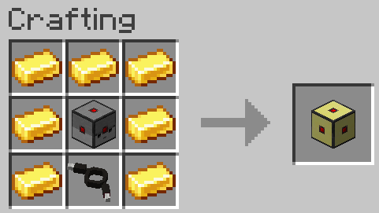

# CC: Wired Connector

CC: Wired Connector is a simple NeoForge addon for [CC: Tweaked][computercraft] and [Drive-By-Wire-Sable][drive-by-wire] that adds a compatibility block for those two mods.

## Content

This mod only adds one block: the Wired Connector.
This block is a CC peripheral that allows the use of Drive-By-Wire channels with CC: Tweaked and works like any other DBW compatible block.
Right-click the connector, select your channel and right-click the block to which you want to output a signal with this channel.
You don't need to struggle with redstone relays and make absolutely non-compact designs for your contraptions.

It can be crafted with the following recipe:

## Wired Connector Methods

Those methods are inspired by the CC built-in redstone library to make them easy to use.

|Method name                     |Utility                                         |Parameters|
|---|---|---|
|setOutput(channel, on)          |Turn the signal of a specific channel on or off.|int channel: The desired channel number bool on: Whether to turn on or off the signal|
|getOutput(channel)              |Get the current output of a specific channel.|int channel: The desired channel number|
|setAnalogOutput(channel, value) |Set the signal strength for a specific channel.|int channel: The desired channel number int value: The signal strength to output|
|getAnalogOutput(channel)        |Get the current output strength for a specific channel|int channel: The desired channel number|

## Requirements

- Minecraft 1.21.1
- NeoForge 21.1.233
- [Drive-By-Wire-With-Sable 0.3.0][dbwversion]
- [CC: Tweaked 1.120.0][ccversion]
- [Create 6.0.10+][createversion] (DBW dependency)
- [Sable 2.0.0+][sable] (DBB dependency)

## Incompatible mods

No incompatible mods have been found for now.

If you ever find an incompatible mod, please let me know by opening an [issue][issues].

## License

MIT, see License.md

[computercraft]: https://github.com/cc-tweaked/CC-Tweaked/
[ccversion]: https://modrinth.com/mod/cc-tweaked/version/8XEJbAee
[drive-by-wire]: https://github.com/Rew1nd-dev/Drive-By-Wire-with-Sable
[dbwversion]: https://modrinth.com/mod/drive-by-wire-sable/version/0.3.0
[createversion]: https://modrinth.com/mod/create/version/6.0.10+mc1.21.1
[sable]: https://modrinth.com/mod/sable/version/2.0.3+mc1.21.1
[issues]: https://github.com/Gelodix/WiredConnector/issues